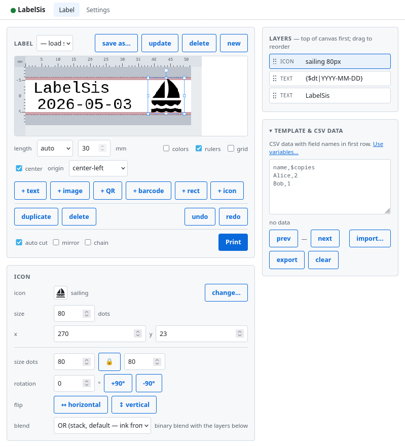

# :label: LabelSis

Network print server for the **Brother PT-P700 family** of label
printers, running on **ESP32-S3** with a self-hosted web UI for
label design.



## Why

Brother ships P-touch Editor (Windows-only desktop) and a mobile app
that talks Bluetooth to a select few models. There is no first-party
way to put a USB-tethered PT-P700 on the LAN and print to it from any
browser. **LabelSis** fills that gap: a single ESP32-S3 turns the
printer into a stand-alone network device with no driver install, no
app, no cloud account, no telemetry.

## How

  * get an ESP32-S3 (or ESP32-S2)
  * upload firmware
  * connect ESP via USB to the P-touch label printer
  * add power
  * start designing in web ui
  * print

## Highlights

- **Browser-based label designer** -- text, images, barcodes, QR
  codes, icons, rectangles, CSV-templated batch printing. Vanilla
  HTML/CSS/JS, no install, runs straight from device flash.
- **Captive-portal Wi-Fi onboarding** -- phones land on the setup
  page automatically; no need to know an IP.
- **Status LED** (single GPIO or WS2812 RGB) -- glance at the device,
  don't grep serial logs.
- **mDNS** at `labelsis.local`; falls back gracefully when blocked.
- **Mock dev server** (Python stdlib only) -- iterate the SPA without
  flashing or even owning the printer.

## Supported printers

Same protocol family per Brother's SDM v1.11. All must be in normal
print mode (slider in **E**, not **EL** / P-Lite -- see
[USAGE.md](doc/USAGE.md#p-lite-mode)).

| Model     | VID:PID    | Notes |
|-----------|------------|-------|
| PT-H500   | 04F9:205E  | Handheld |
| PT-P700   | 04F9:2061  | Reference platform; tested on hardware |
| PT-P750W  | 04F9:2062  | P700 with on-printer Wi-Fi (irrelevant when wired) |
| PT-E500   | 04F9:205F  | Handheld |

## Quick start

```sh
git clone <repo> labelsis && cd labelsis
. ~/esp/esp-idf/export.sh
idf.py set-target esp32s3
idf.py flash monitor
```

Connect a phone or laptop to the **`labelsis-setup`** Wi-Fi the device
brings up on first boot; the captive-portal page leads you through
joining your home network. After that, visit `http://labelsis.local/`.

Full instructions: **[doc/INSTALL.md](doc/INSTALL.md)**. Hardware
list and cabling: **[doc/HARDWARE.md](doc/HARDWARE.md)**.

## Documentation

- **[Install](doc/INSTALL.md)** -- flashing, Wi-Fi onboarding, status LED, BOOT-button reset
- **[Usage](doc/USAGE.md)** -- using the SPA, CSV templating, P-Lite handling
- **[Hardware](doc/HARDWARE.md)** -- devkit notes, cabling, board variants
- **[Development](doc/DEVELOPMENT.md)** -- mock server, SPA dev tricks, CLI, host tests, architecture
- **[Troubleshooting](doc/TROUBLESHOOTING.md)** -- first-hour symptom catalog
- **[Third-party notices](THIRD_PARTY_NOTICES.md)** -- bundled OSS attributions

## Status

**Beta.** Works on a real PT-P700 over Wi-Fi for label design and
printing on an ESP32-S3 devkit. PT-H500 / PT-E500 / PT-P750W are
protocol-family matches per the Brother SDM but untested on hardware.
ESP32-S2 builds clean, untested.

## TODO

 * attach the ESP board neatly to the PT700 printer (currently, it is a mess of wires)

## Security

The HTTP API has **no authentication**: anyone who can reach the
device on the network can print, scan Wi-Fi, or rewrite credentials.
This is a deliberate trade-off for a single-user appliance on a
trusted LAN -- the same posture as a typical home printer's web
panel. Run it on a trusted network, **do not expose port 80 to the
public internet**, and treat the device the way you'd treat any
other unauthenticated LAN appliance.

## License

[MIT](LICENSE). Bundled third-party components keep their own
licenses; see [THIRD_PARTY_NOTICES.md](THIRD_PARTY_NOTICES.md).
